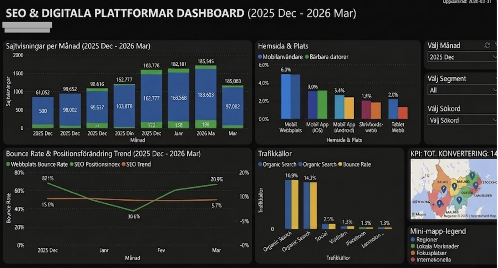

# SEO & Digital Analytics Data Platform & Dashboard

An end-to-end Business Intelligence and Data Engineering solution built in Microsoft Power BI. The platform ingests, transforms, and models digital marketing and organic search data using automated Power Query ETL and a star schema dimensional model to deliver actionable executive KPIs.



---

## 📌 Executive Summary

Digital marketing organizations track high-volume performance metrics across disparate web platforms, search engines, and analytics APIs. Without a centralized, modeled data pipeline, stakeholders face fragmented data, inconsistent definitions, and slow reporting.

This project implements a scalable analytical data solution that:
- Centralizes multi-source digital traffic and SEO data.
- Automates ETL pipelines and data validation.
- Implements dimensional modeling (Star Schema) for sub-second analytical query performance.
- Provides interactive executive dashboards for data-driven strategic decisions.

---

## 🏗️ Architecture & Pipeline Design

The architecture mirrors modern data warehousing standards, separating raw ingestion from transformed business dimensions and analytical reporting:

```text
[ Raw Data Sources / APIs ] (Web Traffic, Search Console, Conversion Logs)
             │
             ▼
[ Power Query / ETL Layer ] (Schema Validation, Type Casting, Deduplication)
             │
             ▼
[ Star Schema Modeling ]   (Fact Tables + Conformed Dimension Tables)
             │
             ▼
[ DAX Analytical Layer ]    (Aggregations, Time Intelligence, Dynamic KPIs)
             │
             ▼
[ Executive Power BI Dashboards ]
